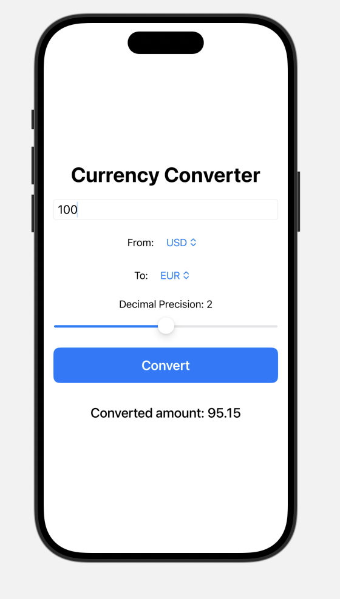

# Currency Converter App

The **Currency Converter App** is a simple and intuitive iOS application built with SwiftUI. It allows users to quickly convert between different currencies using live exchange rates fetched from an online API.

---

## Features
- **Live Exchange Rates:** Fetches up-to-date currency rates from a reliable API.
- **User-Friendly Interface:** Clean and simple design with intuitive inputs.
- **Currency Selection:** Pick your base and target currencies from a list of available options.
- **Error Handling:** Displays helpful error messages if something goes wrong.
- **Dynamic Updates:** Automatically updates rates when the app launches or on user request.

---



---

## Installation
1. Clone the repository:
   ```bash
   git clone https://github.com/yourusername/currency-converter-app.git
   ```
2. Open the project in **Xcode**:
   ```bash
   cd currency-converter-app
   open CurrencyConverter.xcodeproj
   ```
3. Ensure you have the latest version of Xcode installed (version 13 or later).
4. Run the app on a simulator or physical device.

---

## Usage
1. Enter the amount you want to convert in the **Amount** text field.
2. Select the **Base Currency** (currency to convert from) using the dropdown.
3. Select the **Target Currency** (currency to convert to) using the dropdown.
4. View the converted amount instantly!

---

## Architecture
The app uses **MVVM (Model-View-ViewModel)** architecture to separate business logic from the UI.

### Key Files:
- **`CurrencyConvertorViewModel.swift`:** Handles fetching and storing exchange rates, input validation, and conversion logic.
- **`ExchangeRateResponse.swift`:** Decodes JSON responses from the API.
- **`ContentView.swift`:** Main user interface of the app.

---

## API Integration
The app uses the **ExchangeRate-API** to fetch live exchange rates. Ensure you have a valid API key before running the app.

### Setting Up Your API Key:
1. Replace the `apiKey` in `CurrencyConvertorViewModel.swift` with your key:
   ```swift
   private let apiKey = "your-api-key-here"
   ```

---

## Known Issues
- The app may show an empty currency list if exchange rates fail to load.
- Ensure a stable internet connection for live exchange rate updates.
